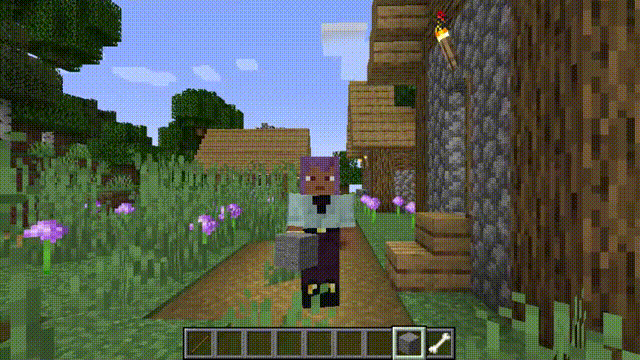

# 自由相机API

[](https://deepwiki.com/AnECanSaiTin/Free-camera-API)

**让相机操作更简单灵活！**




## 如何注册与使用插件

完整示例：[ExamplePlugin](src/main/java/cn/anecansaitin/freecameraapi/ExamplePlugin.java)。

1. 创建插件类
    ```
    @CameraPlugin(value = "example", priority = ModifierPriority.LOWEST)
    public class ExamplePlugin implements ICameraPlugin {
        // ...
    }
    ```
    value: 插件唯一标识符（字符串）
    priority: 优先级设置（ModifierPriority.HIGH/LOWEST等）

2. 初始化
    ```
    @Override
    public void initialize(ICameraModifier modifier) {
        this.modifier = modifier;
        modifier.enable();
    }
    ```
3. 每帧更新相机数据
    ```
    modifier
                .enablePos() //启用坐标修改
                .enableRotation() //启用旋转修改
                .enableFov() //启用FOV修改
                .enableLerp() //启用线性插值
                .setPos(1, 2, 3) //设置相机坐标为(1,2,3)，默认为以玩家坐标为中心的局部坐标
                .addPos(1, 2, 3)
                .setRotationYXZ(90f, 15f, 25f) //设置相机旋转为 (90f, 15f, 25f)
                .move(0, 0, -5) //根据当前旋转情况移动相机
                .enableGlobalMode() //启用全局模式，所有坐标与选装将按照世界坐标修改
                .enableChunkLoader() //启用区块加载，加载当前相机附近的区块
                .enableObstacle() //启用碰撞检测
    ```